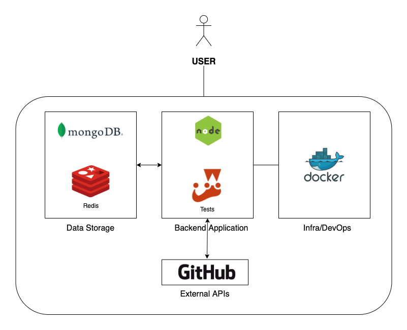

# Lib-quality


## Project Architecture



```1. MongoDB is used to store project metrics and user actions made in the app```<br>
```2. Redis is used to cache responses for queries already made. The cache time of the stored information is one day```<br>
```3. Docker + Docker-Compose is being used for project infra```<br>

## Basic Architecture Flow
```1. User sends a query project name```<br>
```2. Application check if this project was already queried within one day. If yes, response is returned from redis. If not, data is collected from Github API and then, stored on redis.```<br>
```3. User's action is stored on a collection in MongoDB. Infos like the query text and request date are stored.```<br>
```4. Project data returned by Github API is stored on a collection in MongoDB.```<br>

## Environment variables
```PORT=3000```<br>
```MONGO_URL=mongodb://mongo:27017/libquality```<br>
```GITHUB_BASE_URL=https://api.github.com```<br>
```GIT_TOKEN=PutYourGitApiTokenHere```<br>

## Running the project
```npm install```<br>
```docker-compose up```<br>
You can test if the server is up using the route: http://localhost:3000/online

## Running tests
```npm test```

## Api routes details(Swagger)
With the app running, acesse: http://localhost:3000/api-docs


